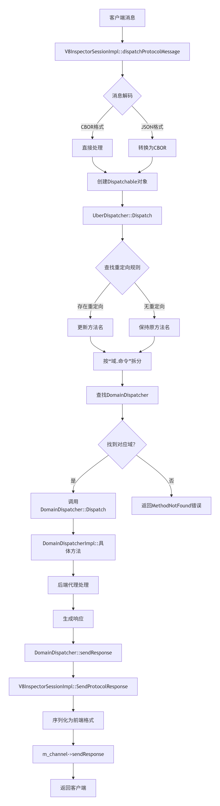
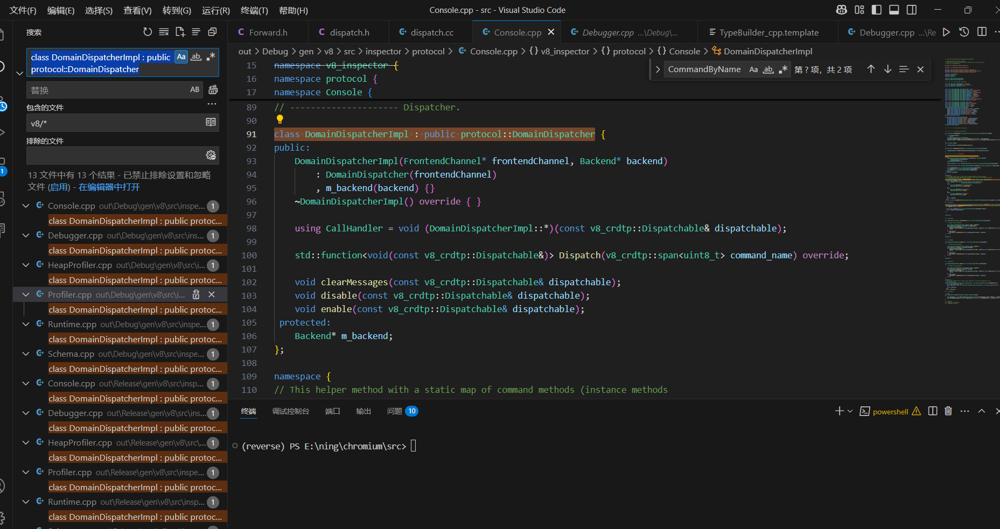

# 前言
这篇文章将带大家从宏观把握 V8 Inspector, 将主要脉络串起来, 这样当你再去研究、魔改某个细微处时不至于没有方向。

实际上掌握了几个类的作用与从属关系, 我们的任务就搞定了。

## 流程图


## 让我们一个一个介绍
将每个类完整的实现和注释贴出, 可以略看一眼:

### V8InspectorImpl 核心控制器​
#### 总结来说, 这个类的核心功能有
- 管理所有调试会话(m_sessions映射表)
- 维护上下文组(contextGroup)与上下文的映射关系(m_contexts)
- 提供调试器核心功能(V8Debugger* debugger())
- 处理JS引擎事件(上下文创建/销毁、异常等)
- 管理控制台消息存储(V8ConsoleMessageStorage)

```cpp
class V8InspectorImpl : public V8Inspector {
 public:
  V8_EXPORT_PRIVATE V8InspectorImpl(v8::Isolate*, V8InspectorClient*);
  ~V8InspectorImpl() override;

  // 禁止拷贝构造和赋值操作，避免对象被拷贝。
  V8InspectorImpl(const V8InspectorImpl&) = delete;
  V8InspectorImpl& operator=(const V8InspectorImpl&) = delete;

  // 获取当前的 V8 引擎隔离区。
  v8::Isolate* isolate() const { return m_isolate; }

  // 获取与该 Inspector 关联的客户端。
  V8InspectorClient* client() { return m_client; }

  // 获取调试器对象。
  V8Debugger* debugger() { return m_debugger.get(); }

  // 获取 Promise 处理器跟踪器。
  PromiseHandlerTracker& promiseHandlerTracker() {
    return m_promiseHandlerTracker;
  }

  // 根据上下文对象获取上下文组 ID。
  int contextGroupId(v8::Local<v8::Context>) const;

  // 根据上下文 ID 获取上下文组 ID。
  int contextGroupId(int contextId) const;

  // 根据唯一 ID 解析上下文 ID。
  int resolveUniqueContextId(internal::V8DebuggerId uniqueId) const;

  // 编译并运行内部脚本。
  v8::MaybeLocal<v8::Value> compileAndRunInternalScript(v8::Local<v8::Context>,
                                                        v8::Local<v8::String>);

  // 编译脚本。
  v8::MaybeLocal<v8::Script> compileScript(v8::Local<v8::Context>,
                                           const String16& code,
                                           const String16& fileName);

  // 获取正则表达式上下文。
  v8::MaybeLocal<v8::Context> regexContext();

  // 获取异常元数据上下文。
  v8::MaybeLocal<v8::Context> exceptionMetaDataContext();

  // 连接到调试会话，返回一个独立的会话对象。
  std::unique_ptr<V8InspectorSession> connect(int contextGroupId,
                                              V8Inspector::Channel*,
                                              StringView state,
                                              ClientTrustLevel,
                                              SessionPauseState) override;

  // 连接到调试会话，返回一个共享的会话对象。
  std::shared_ptr<V8InspectorSession> connectShared(int contextGroupId,
                                                    V8Inspector::Channel*,
                                                    StringView state,
                                                    ClientTrustLevel,
                                                    SessionPauseState) override;

  // 通知上下文创建。
  void contextCreated(const V8ContextInfo&) override;

  // 通知上下文销毁。
  void contextDestroyed(v8::Local<v8::Context>) override;

  // 根据上下文 ID 获取上下文对象。
  v8::MaybeLocal<v8::Context> contextById(int contextId) override;

  // 获取上下文的唯一调试器 ID。
  V8DebuggerId uniqueDebuggerId(int contextId) override;

  // 获取隔离区的唯一 ID。
  uint64_t isolateId() override;

  // 通知上下文被回收。
  void contextCollected(int contextGroupId, int contextId);

  // 重置上下文组。
  void resetContextGroup(int contextGroupId) override;

  // 通知空闲状态开始。
  void idleStarted() override;

  // 通知空闲状态结束。
  void idleFinished() override;

  // 通知异常被抛出。
  unsigned exceptionThrown(v8::Local<v8::Context>, StringView message,
                           v8::Local<v8::Value> exception,
                           StringView detailedMessage, StringView url,
                           unsigned lineNumber, unsigned columnNumber,
                           std::unique_ptr<V8StackTrace>,
                           int scriptId) override;

  // 通知异常被撤销。
  void exceptionRevoked(v8::Local<v8::Context>, unsigned exceptionId,
                        StringView message) override;

  // 创建堆栈跟踪。
  std::unique_ptr<V8StackTrace> createStackTrace(
      v8::Local<v8::StackTrace>) override;

  // 捕获当前堆栈跟踪。
  std::unique_ptr<V8StackTrace> captureStackTrace(bool fullStack) override;

  // 通知异步任务被调度。
  void asyncTaskScheduled(StringView taskName, void* task,
                          bool recurring) override;

  // 通知异步任务被取消。
  void asyncTaskCanceled(void* task) override;

  // 通知异步任务开始。
  void asyncTaskStarted(void* task) override;

  // 通知异步任务结束。
  void asyncTaskFinished(void* task) override;

  // 通知所有异步任务被取消。
  void allAsyncTasksCanceled() override;

  // 存储当前堆栈跟踪。
  V8StackTraceId storeCurrentStackTrace(StringView description) override;

  // 通知外部异步任务开始。
  void externalAsyncTaskStarted(const V8StackTraceId& parent) override;

  // 通知外部异步任务结束。
  void externalAsyncTaskFinished(const V8StackTraceId& parent) override;

  // 关联异常数据。
  V8_EXPORT_PRIVATE bool associateExceptionData(
      v8::Local<v8::Context>, v8::Local<v8::Value> exception,
      v8::Local<v8::Name> key, v8::Local<v8::Value> value) override;

  // 获取下一个异常 ID。
  unsigned nextExceptionId() { return ++m_lastExceptionId; }

  // 静音指定上下文组的异常。
  void muteExceptions(int contextGroupId);

  // 取消静音指定上下文组的异常。
  void unmuteExceptions(int contextGroupId);

  // 确保指定上下文组有控制台消息存储。
  V8ConsoleMessageStorage* ensureConsoleMessageStorage(int contextGroupId);

  // 检查指定上下文组是否有控制台消息存储。
  bool hasConsoleMessageStorage(int contextGroupId);

  // 丢弃被检查的上下文。
  void discardInspectedContext(int contextGroupId, int contextId);

  // 断开与调试会话的连接。
  void disconnect(V8InspectorSessionImpl*);

  // 根据上下文组 ID 和会话 ID 获取调试会话。
  V8InspectorSessionImpl* sessionById(int contextGroupId, int sessionId);

  // 根据上下文 ID 获取被检查的上下文。
  InspectedContext* getContext(int groupId, int contextId) const;

  // 根据上下文 ID 获取被检查的上下文。
  InspectedContext* getContext(int contextId) const;

  // 获取控制台对象。
  V8_EXPORT_PRIVATE V8Console* console();

  // 遍历指定上下文组的所有上下文。
  void forEachContext(int contextGroupId,
                      const std::function<void(InspectedContext*)>& callback);

  // 遍历指定上下文组的所有调试会话。
  void forEachSession(
      int contextGroupId,
      const std::function<void(V8InspectorSessionImpl*)>& callback);

  // 生成唯一 ID。
  int64_t generateUniqueId();

  // 获取与异常关联的数据。
  V8_EXPORT_PRIVATE v8::MaybeLocal<v8::Object> getAssociatedExceptionData(
      v8::Local<v8::Value> exception);

  // 获取与异常关联的数据(协议格式)。
  std::unique_ptr<protocol::DictionaryValue>
  getAssociatedExceptionDataForProtocol(v8::Local<v8::Value> exception);

  // EvaluateScope 类用于在特定作用域内执行脚本。
  class EvaluateScope {
   public:
    // 构造函数，初始化作用域。
    explicit EvaluateScope(const InjectedScript::Scope& scope);

    // 析构函数，清理资源。
    ~EvaluateScope();

    // 设置超时时间。
    protocol::Response setTimeout(double timeout);

   private:
    // 内部类和结构体，用于实现超时终止功能。
    class TerminateTask;
    struct CancelToken;

    // 作用域对象。
    const InjectedScript::Scope& m_scope;

    // V8 引擎隔离区。
    v8::Isolate* m_isolate;

    // 取消令牌。
    std::shared_ptr<CancelToken> m_cancelToken;
  };

 private:
  // 实现连接逻辑。
  V8InspectorSessionImpl* connectImpl(int contextGroupId, V8Inspector::Channel*,
                                      StringView state, ClientTrustLevel,
                                      SessionPauseState);

  // V8 引擎隔离区。
  v8::Isolate* m_isolate;

  // 客户端对象。
  V8InspectorClient* m_client;

  // 调试器对象。
  std::unique_ptr<V8Debugger> m_debugger;

  // 正则表达式上下文。
  v8::Global<v8::Context> m_regexContext;

  // 异常元数据上下文。
  v8::Global<v8::Context> m_exceptionMetaDataContext;

  // 异常元数据表。
  v8::Global<v8::debug::EphemeronTable> m_exceptionMetaData;

  // 上一个异常 ID。
  unsigned m_lastExceptionId;

  // 上一个上下文 ID。
  int m_lastContextId;

  // 上一个会话 ID。
  int m_lastSessionId = 0;

  // 静音异常的映射表(上下文组 ID -> 静音级别)。
  using MuteExceptionsMap = std::unordered_map<int, int>;
  MuteExceptionsMap m_muteExceptionsMap;

  // 上下文映射表(上下文 ID -> 被检查的上下文对象)。
  using ContextByIdMap =
      std::unordered_map<int, std::unique_ptr<InspectedContext>>;

  // 上下文组映射表(上下文组 ID -> 上下文映射表)。
  using ContextsByGroupMap =
      std::unordered_map<int, std::unique_ptr<ContextByIdMap>>;
  ContextsByGroupMap m_contexts;

  // 会话映射表(上下文组 ID -> 会话 ID -> 调试会话对象)。
  std::unordered_map<int, std::map<int, V8InspectorSessionImpl*>> m_sessions;

  // 调试器屏障映射表(上下文组 ID -> 调试器屏障)。
  std::unordered_map<int, std::weak_ptr<V8DebuggerBarrier>> m_debuggerBarriers;

  // 控制台消息存储映射表(上下文组 ID -> 控制台消息存储对象)。
  using ConsoleStorageMap =
      std::unordered_map<int, std::unique_ptr<V8ConsoleMessageStorage>>;
  ConsoleStorageMap m_consoleStorageMap;

  // 上下文 ID 到上下文组 ID 的映射表。
  std::unordered_map<int, int> m_contextIdToGroupIdMap;

  // 唯一 ID 到上下文 ID 的映射表。
  std::map<std::pair<int64_t, int64_t>, int> m_uniqueIdToContextId;

  // 控制台对象。
  std::unique_ptr<V8Console> m_console;

  // Promise 处理器跟踪器。
  PromiseHandlerTracker m_promiseHandlerTracker;
};
```

### ​​V8InspectorSessionImpl 会话实体​
#### 总的来说这个类的核心功能有
- 实现协议消息分发(dispatchProtocolMessage())
- 管理协议域代理(Runtime/Debugger/Console等)
- 实现双向通信通道(FrontendChannel)
- 维护会话状态(m_state)

```cpp
class V8InspectorSessionImpl : public V8InspectorSession,
                               public protocol::FrontendChannel {
 public:
  // 静态工厂方法，用于创建 V8InspectorSessionImpl 对象。
  static V8InspectorSessionImpl* create(
      V8InspectorImpl*, int contextGroupId, int sessionId,
      V8Inspector::Channel*, StringView state,
      v8_inspector::V8Inspector::ClientTrustLevel,
      std::shared_ptr<V8DebuggerBarrier>);

  ~V8InspectorSessionImpl() override;

  // 禁止拷贝构造和赋值操作，避免对象被拷贝。
  V8InspectorSessionImpl(const V8InspectorSessionImpl&) = delete;
  V8InspectorSessionImpl& operator=(const V8InspectorSessionImpl&) = delete;

  // 获取与该会话关联的 Inspector 实例。
  V8InspectorImpl* inspector() const { return m_inspector; }

  // 获取控制台代理。
  V8ConsoleAgentImpl* consoleAgent() { return m_consoleAgent.get(); }

  // 获取调试器代理。
  V8DebuggerAgentImpl* debuggerAgent() { return m_debuggerAgent.get(); }

  // 获取 Schema 代理。
  V8SchemaAgentImpl* schemaAgent() { return m_schemaAgent.get(); }

  // 获取性能分析代理。
  V8ProfilerAgentImpl* profilerAgent() { return m_profilerAgent.get(); }

  // 获取运行时代理。
  V8RuntimeAgentImpl* runtimeAgent() { return m_runtimeAgent.get(); }

  // 获取堆性能分析代理。
  V8HeapProfilerAgentImpl* heapProfilerAgent() {
    return m_heapProfilerAgent.get();
  }

  // 获取上下文组 ID。
  int contextGroupId() const { return m_contextGroupId; }

  // 获取会话 ID。
  int sessionId() const { return m_sessionId; }

  // 查找注入脚本。
  Response findInjectedScript(int contextId, InjectedScript*&);

  // 根据 RemoteObjectId 查找注入脚本。
  Response findInjectedScript(RemoteObjectIdBase*, InjectedScript*&);

  // 重置会话状态。
  void reset();

  // 丢弃所有注入脚本。
  void discardInjectedScripts();

  // 报告所有上下文信息。
  void reportAllContexts(V8RuntimeAgentImpl*);

  // 设置自定义对象格式化器是否启用。
  void setCustomObjectFormatterEnabled(bool);

  // 将 V8 值包装为远程对象。
  std::unique_ptr<protocol::Runtime::RemoteObject> wrapObject(
      v8::Local<v8::Context>, v8::Local<v8::Value>, const String16& groupName,
      bool generatePreview);

  // 将表格数据包装为远程对象。
  std::unique_ptr<protocol::Runtime::RemoteObject> wrapTable(
      v8::Local<v8::Context>, v8::Local<v8::Object> table,
      v8::MaybeLocal<v8::Array> columns);

  // 获取支持的协议域。
  std::vector<std::unique_ptr<protocol::Schema::Domain>> supportedDomainsImpl();

  // 解包远程对象。
  Response unwrapObject(const String16& objectId, v8::Local<v8::Value>*,
                        v8::Local<v8::Context>*, String16* objectGroup);

  // 释放对象组。
  void releaseObjectGroup(const String16& objectGroup);

  // V8InspectorSession 接口的实现。
  void dispatchProtocolMessage(StringView message) override;
  std::vector<uint8_t> state() override;
  std::vector<std::unique_ptr<protocol::Schema::API::Domain>> supportedDomains()
      override;
  void addInspectedObject(
      std::unique_ptr<V8InspectorSession::Inspectable>) override;
  void schedulePauseOnNextStatement(StringView breakReason,
                                    StringView breakDetails) override;
  void cancelPauseOnNextStatement() override;
  void breakProgram(StringView breakReason, StringView breakDetails) override;
  void setSkipAllPauses(bool) override;
  void resume(bool terminateOnResume = false) override;
  void stepOver() override;
  std::vector<std::unique_ptr<protocol::Debugger::API::SearchMatch>>
  searchInTextByLines(StringView text, StringView query, bool caseSensitive,
                      bool isRegex) override;
  void releaseObjectGroup(StringView objectGroup) override;
  bool unwrapObject(std::unique_ptr<StringBuffer>*, StringView objectId,
                    v8::Local<v8::Value>*, v8::Local<v8::Context>*,
                    std::unique_ptr<StringBuffer>* objectGroup) override;
  std::unique_ptr<protocol::Runtime::API::RemoteObject> wrapObject(
      v8::Local<v8::Context>, v8::Local<v8::Value>, StringView groupName,
      bool generatePreview) override;

  // 获取被检查的对象。
  V8InspectorSession::Inspectable* inspectedObject(unsigned num);

  // 被检查对象缓冲区大小。
  static const unsigned kInspectedObjectBufferSize = 5;

  // 触发精确覆盖增量更新。
  void triggerPreciseCoverageDeltaUpdate(StringView occasion) override;

  // 在上下文中评估表达式。
  EvaluateResult evaluate(v8::Local<v8::Context> context, StringView expression,
                           bool includeCommandLineAPI = false) override;

  // 停止会话。
  void stop() override;

  // 获取客户端信任级别。
  V8Inspector::ClientTrustLevel clientTrustLevel() {
    return m_clientTrustLevel;
  }

  // 设置弱引用的 this 指针。
  void setWeakThis(std::weak_ptr<V8InspectorSessionImpl> weakThis) {
    m_weakThis = std::move(weakThis);
  }

 private:
  // 私有构造函数，仅通过 create 方法创建对象。
  V8InspectorSessionImpl(V8InspectorImpl*, int contextGroupId, int sessionId,
                         V8Inspector::Channel*, StringView state,
                         V8Inspector::ClientTrustLevel,
                         std::shared_ptr<V8DebuggerBarrier>);

  // 获取代理的状态字典。
  protocol::DictionaryValue* agentState(const String16& name);

  // protocol::FrontendChannel 接口的实现。
  void SendProtocolResponse(
      int callId, std::unique_ptr<protocol::Serializable> message) override;
  void SendProtocolNotification(
      std::unique_ptr<protocol::Serializable> message) override;
  void FallThrough(int callId, v8_crdtp::span<uint8_t> method,
                   v8_crdtp::span<uint8_t> message) override;
  void FlushProtocolNotifications() override;

  // 序列化消息以发送到前端。
  std::unique_ptr<StringBuffer> serializeForFrontend(
      std::unique_ptr<protocol::Serializable> message);

  // 上下文组 ID。
  int m_contextGroupId;

  // 会话 ID。
  int m_sessionId;

  // 关联的 Inspector 实例。
  V8InspectorImpl* m_inspector;

  // 通信通道。
  V8Inspector::Channel* m_channel;

  // 是否启用自定义对象格式化器。
  bool m_customObjectFormatterEnabled;

  // 协议分发器。
  protocol::UberDispatcher m_dispatcher;

  // 会话状态。
  std::unique_ptr<protocol::DictionaryValue> m_state;

  // 运行时代理。
  std::unique_ptr<V8RuntimeAgentImpl> m_runtimeAgent;

  // 调试器代理。
  std::unique_ptr<V8DebuggerAgentImpl> m_debuggerAgent;

  // 堆性能分析代理。
  std::unique_ptr<V8HeapProfilerAgentImpl> m_heapProfilerAgent;

  // 性能分析代理。
  std::unique_ptr<V8ProfilerAgentImpl> m_profilerAgent;

  // 控制台代理。
  std::unique_ptr<V8ConsoleAgentImpl> m_consoleAgent;

  // Schema 代理。
  std::unique_ptr<V8SchemaAgentImpl> m_schemaAgent;

  // 被检查的对象列表。
  std::vector<std::unique_ptr<V8InspectorSession::Inspectable>>
      m_inspectedObjects;

  // 是否使用二进制协议。
  bool use_binary_protocol_ = false;

  // 客户端信任级别。
  V8Inspector::ClientTrustLevel m_clientTrustLevel = V8Inspector::kUntrusted;

  // 用于在 dispatchProtocolMessage 调用中保持会话对象存活的作用域类。
  class KeepSessionAliveScope {
   public:
    explicit KeepSessionAliveScope(const V8InspectorSessionImpl& session)
        : m_this(session.m_weakThis.lock()) {}

   private:
    std::shared_ptr<V8InspectorSessionImpl> m_this;
  };

  // 用于在嵌套运行循环中保持会话对象存活的弱引用。
  std::weak_ptr<V8InspectorSessionImpl> m_weakThis;
};
```

### UberDispatcher CDP 协议处理的​​一级路由器​
#### 总的来说这个类的核心功能有
- 解析 domain.command 格式的消息
- 实现协议域(如 Console/Debugger)的分发路由
- 支持命令重定向机制

```cpp
class UberDispatcher {
 public:
  // DispatchResult 类是 ::Dispatch 方法的返回类型，表示分发的结果。
  class DispatchResult {
   public:
    // 构造函数，初始化分发结果。
    DispatchResult(bool method_found, std::function<void()> runnable);

    // 检查方法是否被找到，即是否可以分发到注册到此分发器的后端。
    bool MethodFound() const { return method_found_; }

    // 运行分发结果。如果方法未找到或参数解析出错，将发送适当的错误响应。
    void Run();

   private:
    // 方法是否被找到的标志。
    bool method_found_;

    // 可运行的回调函数，用于执行分发操作。
    std::function<void()> runnable_;
  };

  // 构造函数，初始化 UberDispatcher 对象。
  // |frontend_channel| 不能为空。
  explicit UberDispatcher(FrontendChannel* frontend_channel);

  // 析构函数。
  virtual ~UberDispatcher();

  // 分发提供的 |dispatchable| 消息，考虑所有注册到此 UberDispatcher 的重定向和域处理器。
  // 也请参见 |DispatchResult|。
  // 调用者必须单独检查 |dispatchable.ok()| 并处理错误。
  DispatchResult Dispatch(const Dispatchable& dispatchable) const;

  // 从生成的代码中调用，用于连接域后端，即将域处理器连接到 UberDispatcher。
  // 例如：<domain-namespace>::Dispatcher::Wire(UberDispatcher*, Backend*)。
  FrontendChannel* channel() const {
    assert(frontend_channel_);
    return frontend_channel_;
  }

  // 从生成的代码中调用，用于连接域后端，即将域处理器连接到 UberDispatcher。
  // 例如：<domain-namespace>::Dispatcher::Wire(UberDispatcher*, Backend*)。
  void WireBackend(span<uint8_t> domain,
                   const std::vector<std::pair<span<uint8_t>, span<uint8_t>>>&,
                   std::unique_ptr<DomainDispatcher> dispatcher);

 private:
  // 查找与指定方法匹配的域分发器。
  DomainDispatcher* findDispatcher(span<uint8_t> method);

  // 前端通信通道，用于发送响应和通知。
  FrontendChannel* const frontend_channel_;

  // 重定向规则列表，包含形如 ("Domain1.method1", "Domain2.method2") 的 ASCII 字符串对，
  // 表示第一个元素的方法将重定向到第二个元素的方法。按第一个元素排序。
  std::vector<std::pair<span<uint8_t>, span<uint8_t>>> redirects_;

  // 域分发器实例列表，按域名排序。
  std::vector<std::pair<span<uint8_t>, std::unique_ptr<DomainDispatcher>>>
      dispatchers_;
};
```

### DomainDispatcher 协议域内的​​二级命令分发器​
#### 总的来说这个类的核心功能有
- 实现具体协议域内的命令分发
- 由子类实现具体路由逻辑

```cpp
class DomainDispatcher {
 public:
  // WeakPtr 类是一个弱指针类，用于安全地引用 DomainDispatcher 对象。
  class WeakPtr {
   public:
    // 构造函数，初始化弱指针。
    explicit WeakPtr(DomainDispatcher*);

    // 析构函数，清理资源。
    ~WeakPtr();

    // 获取指向 DomainDispatcher 的指针。
    DomainDispatcher* get() { return dispatcher_; }

    // 释放弱指针，将其置为 nullptr。
    void dispose() { dispatcher_ = nullptr; }

   private:
    // 指向 DomainDispatcher 的指针。
    DomainDispatcher* dispatcher_;
  };

  // Callback 类是一个回调类，用于处理协议命令的响应。
  class Callback {
   public:
    // 虚析构函数，确保派生类可以正确析构。
    virtual ~Callback();

    // 释放回调资源。
    void dispose();

   protected:
    // 构造函数，初始化回调对象。
    // |method| 必须指向静态存储(通常是 C++ 字符串字面量)。
    Callback(std::unique_ptr<WeakPtr> backend_impl,
             int call_id,
             span<uint8_t> method,
             span<uint8_t> message);

    // 如果回调仍然有效，则发送响应。
    void sendIfActive(std::unique_ptr<Serializable> partialMessage,
                      const DispatchResponse& response);

    // 如果回调仍然有效，则触发回退逻辑。
    void fallThroughIfActive();

   private:
    // 弱指针，用于引用后端实现。
    std::unique_ptr<WeakPtr> backend_impl_;

    // 调用 ID，用于标识请求。
    int call_id_;

    // 方法名，存储在进程中(通常是字符串字面量)。
    span<uint8_t> method_;

    // 消息内容。
    std::vector<uint8_t> message_;
  };

  // 构造函数，初始化 DomainDispatcher 对象。
  explicit DomainDispatcher(FrontendChannel*);

  // 虚析构函数，确保派生类可以正确析构。
  virtual ~DomainDispatcher();

  // 根据命令名查找对应的方法。
  // 如果方法未找到，则返回 nullptr。
  // 否则返回一个闭包，该闭包将解析 Dispatchable.params() 为协议对象并执行相应的方法。
  // 如果解析失败，则在前端通道上发送错误响应；否则执行命令。
  virtual std::function<void(const Dispatchable&)> Dispatch(
      span<uint8_t> command_name) = 0;

  // 通过前端通道向客户端发送响应。
  void sendResponse(int call_id,
                    const DispatchResponse&,
                    std::unique_ptr<Serializable> result = nullptr);

  // 报告无效参数错误。
  void ReportInvalidParams(const Dispatchable& dispatchable,
                           const DeserializerState& state);

  // 获取前端通道。
  FrontendChannel* channel() { return frontend_channel_; }

  // 清除前端通道。
  void clearFrontend();

  // 获取 DomainDispatcher 的弱指针。
  std::unique_ptr<WeakPtr> weakPtr();

 private:
  // 前端通道，用于与客户端通信。
  FrontendChannel* frontend_channel_;

  // 存储所有弱指针的集合，用于管理弱指针的生命周期。
  std::unordered_set<WeakPtr*> weak_ptrs_;
};
```

## 让我们将这些类串起来
V8InspectorImpl 类中的 `std::unordered_map<int, std::map<int, V8InspectorSessionImpl*>> m_sessions` 储存、管理 V8InspectorSessionImpl 类的实例。

 V8InspectorSessionImpl 类中的 `protocol::UberDispatcher m_dispatcher` 是 UberDispatcher 类的实例, 来解析 CDP 协议处理的​​一级路由器​, 接收消息后, 通过 `V8InspectorSessionImpl::dispatchProtocolMessage` 函数调用 `m_dispatcher.Dispatch` 也就是  UberDispatcher 类的 `Dispatch` 方法, 实现代码如下:
```cpp
void V8InspectorSessionImpl::dispatchProtocolMessage(StringView message) {
  KeepSessionAliveScope keepAlive(*this);

  using v8_crdtp::span;
  using v8_crdtp::SpanFrom;
  span<uint8_t> cbor;
  std::vector<uint8_t> converted_cbor;
  if (IsCBORMessage(message)) {
    use_binary_protocol_ = true;
    m_state->setBoolean("use_binary_protocol", true);
    cbor = span<uint8_t>(message.characters8(), message.length());
  } else {
    // We're ignoring the return value of the conversion function
    // intentionally. It means the |parsed_message| below will be nullptr.
    auto status = ConvertToCBOR(message, &converted_cbor);
    if (!status.ok()) {
      m_channel->sendNotification(
          serializeForFrontend(v8_crdtp::CreateErrorNotification(
              v8_crdtp::DispatchResponse::ParseError(status.ToASCIIString()))));
      return;
    }
    cbor = SpanFrom(converted_cbor);
  }
  v8_crdtp::Dispatchable dispatchable(cbor);
  if (!dispatchable.ok()) {
    if (!dispatchable.HasCallId()) {
      m_channel->sendNotification(serializeForFrontend(
          v8_crdtp::CreateErrorNotification(dispatchable.DispatchError())));
    } else {
      m_channel->sendResponse(
          dispatchable.CallId(),
          serializeForFrontend(v8_crdtp::CreateErrorResponse(
              dispatchable.CallId(), dispatchable.DispatchError())));
    }
    return;
  }
  m_dispatcher.Dispatch(dispatchable).Run(); // 在这里进行查找
}
```
然后在 `m_dispatcher.Dispatch` 方法内通过实例的 `dispatchers_` 属性查找到二级命令分发器, 也就是 DomainDispatcher 类的实例, 实现代码:
```cpp
UberDispatcher::DispatchResult UberDispatcher::Dispatch(
    const Dispatchable& dispatchable) const {
  span<uint8_t> method = FindByFirst(redirects_, dispatchable.Method(),
                                     /*default_value=*/dispatchable.Method());
  size_t dot_idx = DotIdx(method);
  if (dot_idx != kNotFound) {
    span<uint8_t> domain = method.subspan(0, dot_idx);
    span<uint8_t> command = method.subspan(dot_idx + 1);
    DomainDispatcher* dispatcher = FindByFirst(dispatchers_, domain); // 在这里进行查找
    if (dispatcher) {
      std::function<void(const Dispatchable&)> dispatched =
          dispatcher->Dispatch(command); // 再调用二级命令分发器的 Dispatch
      if (dispatched) {
        return DispatchResult(
            true, [dispatchable, dispatched = std::move(dispatched)]() {
              dispatched(dispatchable);
            });
      }
    }
  }
  return DispatchResult(false, [this, dispatchable]() {
    frontend_channel_->SendProtocolResponse(
        dispatchable.CallId(),
        CreateErrorResponse(dispatchable.CallId(),
                            DispatchResponse::MethodNotFound(
                                "'" +
                                std::string(dispatchable.Method().begin(),
                                            dispatchable.Method().end()) +
                                "' wasn't found")));
  });
}
```
查找到二级命令分发器 `dispatcher` 后, 在调用它的 `Dispatch`。而由 `DomainDispatcher` 的子类实现各自的逻辑, 可以搜索 `class DomainDispatcherImpl : public protocol::DomainDispatcher`


### chromium/src/out/Debug/gen/v8/src/inspector/protocol/Console.cpp
```cpp
class DomainDispatcherImpl : public protocol::DomainDispatcher {
public:
    DomainDispatcherImpl(FrontendChannel* frontendChannel, Backend* backend)
        : DomainDispatcher(frontendChannel)
        , m_backend(backend) {}
    ~DomainDispatcherImpl() override { }

    using CallHandler = void (DomainDispatcherImpl::*)(const v8_crdtp::Dispatchable& dispatchable);

    std::function<void(const v8_crdtp::Dispatchable&)> Dispatch(v8_crdtp::span<uint8_t> command_name) override;

    void clearMessages(const v8_crdtp::Dispatchable& dispatchable);
    void disable(const v8_crdtp::Dispatchable& dispatchable);
    void enable(const v8_crdtp::Dispatchable& dispatchable);
 protected:
    Backend* m_backend;
};
```

### chromium/src/out/Debug/gen/v8/src/inspector/protocol/Debugger.cpp
```cpp
class DomainDispatcherImpl : public protocol::DomainDispatcher {
public:
    DomainDispatcherImpl(FrontendChannel* frontendChannel, Backend* backend)
        : DomainDispatcher(frontendChannel)
        , m_backend(backend) {}
    ~DomainDispatcherImpl() override { }

    using CallHandler = void (DomainDispatcherImpl::*)(const v8_crdtp::Dispatchable& dispatchable);

    std::function<void(const v8_crdtp::Dispatchable&)> Dispatch(v8_crdtp::span<uint8_t> command_name) override;

    void continueToLocation(const v8_crdtp::Dispatchable& dispatchable);
    void disable(const v8_crdtp::Dispatchable& dispatchable);
    void enable(const v8_crdtp::Dispatchable& dispatchable);
    void evaluateOnCallFrame(const v8_crdtp::Dispatchable& dispatchable);
    void getPossibleBreakpoints(const v8_crdtp::Dispatchable& dispatchable);
    void getScriptSource(const v8_crdtp::Dispatchable& dispatchable);
    void disassembleWasmModule(const v8_crdtp::Dispatchable& dispatchable);
    void nextWasmDisassemblyChunk(const v8_crdtp::Dispatchable& dispatchable);
    void getWasmBytecode(const v8_crdtp::Dispatchable& dispatchable);
    void getStackTrace(const v8_crdtp::Dispatchable& dispatchable);
    void pause(const v8_crdtp::Dispatchable& dispatchable);
    void pauseOnAsyncCall(const v8_crdtp::Dispatchable& dispatchable);
    void removeBreakpoint(const v8_crdtp::Dispatchable& dispatchable);
    void restartFrame(const v8_crdtp::Dispatchable& dispatchable);
    void resume(const v8_crdtp::Dispatchable& dispatchable);
    void searchInContent(const v8_crdtp::Dispatchable& dispatchable);
    void setAsyncCallStackDepth(const v8_crdtp::Dispatchable& dispatchable);
    void setBlackboxExecutionContexts(const v8_crdtp::Dispatchable& dispatchable);
    void setBlackboxPatterns(const v8_crdtp::Dispatchable& dispatchable);
    void setBlackboxedRanges(const v8_crdtp::Dispatchable& dispatchable);
    void setBreakpoint(const v8_crdtp::Dispatchable& dispatchable);
    void setInstrumentationBreakpoint(const v8_crdtp::Dispatchable& dispatchable);
    void setBreakpointByUrl(const v8_crdtp::Dispatchable& dispatchable);
    void setBreakpointOnFunctionCall(const v8_crdtp::Dispatchable& dispatchable);
    void setBreakpointsActive(const v8_crdtp::Dispatchable& dispatchable);
    void setPauseOnExceptions(const v8_crdtp::Dispatchable& dispatchable);
    void setReturnValue(const v8_crdtp::Dispatchable& dispatchable);
    void setScriptSource(const v8_crdtp::Dispatchable& dispatchable);
    void setSkipAllPauses(const v8_crdtp::Dispatchable& dispatchable);
    void setVariableValue(const v8_crdtp::Dispatchable& dispatchable);
    void stepInto(const v8_crdtp::Dispatchable& dispatchable);
    void stepOut(const v8_crdtp::Dispatchable& dispatchable);
    void stepOver(const v8_crdtp::Dispatchable& dispatchable);
 protected:
    Backend* m_backend;
};
```

### ......不在一一列举

## 以 `chromium/src/out/Debug/gen/v8/src/inspector/protocol/Console.cpp` 中的 `enable` 举例, 看看是怎么实现的
```cpp
void DomainDispatcherImpl::enable(const v8_crdtp::Dispatchable& dispatchable)
{
    // Prepare input parameters.

    std::unique_ptr<DomainDispatcher::WeakPtr> weak = weakPtr();
    DispatchResponse response = m_backend->enable();
    if (response.IsFallThrough()) {
        channel()->FallThrough(dispatchable.CallId(), v8_crdtp::SpanFrom("Console.enable"), dispatchable.Serialized());
        return;
    }
    if (weak->get())
        weak->get()->sendResponse(dispatchable.CallId(), response);
    return;
}
```
再跟进 `weak->get()->sendResponse` 方法:
```cpp
void DomainDispatcher::sendResponse(int call_id,
                                    const DispatchResponse& response,
                                    std::unique_ptr<Serializable> result) {
  if (!frontend_channel_)
    return;
  std::unique_ptr<Serializable> serializable;
  if (response.IsError()) {
    serializable = CreateErrorResponse(call_id, response);
  } else {
    serializable = CreateResponse(call_id, std::move(result));
  }
  frontend_channel_->SendProtocolResponse(call_id, std::move(serializable));
}
```
再跟进 `frontend_channel_->SendProtocolResponse`
```cpp
void V8InspectorSessionImpl::SendProtocolResponse(
    int callId, std::unique_ptr<protocol::Serializable> message) {
  m_channel->sendResponse(callId, serializeForFrontend(std::move(message)));
}
```
可以看到回到了 V8InspectorSessionImpl 类的 `SendProtocolResponse` 方法, 最终由 `V8Inspector::Channel* m_channel` 的 `sendResponse` 发送, 脱离 `V8 Inspector` 体系, 到了 `third_party/blink/renderer/core/inspector/devtools_session.cc` 中, 我们也到此为止, 不在继续。

## 参考文章
https://zhuanlan.zhihu.com/p/424623181