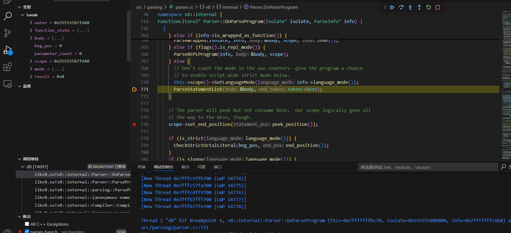

为了开始我们的 v8 之旅需要做一些准备...

## 环境
Ubuntu 22.04, V8 13.6.0, clang++ 

## 下载 & 编译
### 下载
```bash
# 找个目录把 depot_tools 下载下来
git clone https://chromium.googlesource.com/chromium/tools/depot_tools.git
export PATH=/path/to/depot_tools:$PATH

gclient 
# 等待出现如下内容，可能要等一会
Usage: gclient.py <command> [options]

Meta checkout dependency manager for Git.

Commands are:
  config   creates a .gclient file in the current directory
  diff     displays local diff for every dependencies
  fetch    fetches upstream commits for all modules
  flatten  flattens the solutions into a single DEPS file
  getdep   gets revision information and variable values from a DEPS file
  grep     greps through git repos managed by gclient
  help     prints list of commands or help for a specific command
  metrics  reports, and optionally modifies, the status of metric collection
# ....
# 等待出现上述内容，可能要等一会

# 不去更新 depot_tools 
export DEPOT_TOOLS_UPDATE=0
# 下载 V8 源码
fetch v8

# 指定版本----可选
git checkout -b 13.6 -t branch-heads/13.6
gclient sync
# ----可选
```

### 编译
```bash
gn gen out/debug --export-compile-commands

vim out/debug/args.gn
# 填入以下配置
is_debug = true
v8_enable_object_print = true
v8_enable_trace_ignition = true
is_component_build = true
v8_optimized_debug = false
clang = true

ninja -C out/debug d8
```

## vscode 配置 & vscode 调试
下载`clangd`插件和`clangd`本身，将`out/debug/`中的`compile_commands.json`文件移到根目录(或者配置 `clangd` 参数)，下载`C/C++`插件，设置`C/C++`插件，关闭一些功能，`C/C++`插件只为了让 vscode 支持 gdb 调试，其他的功能如代码补全、跳转、代码颜色...由`clangd`插件负责，当用过了`clangd`插件你才知道什么叫丝滑。

给出`launch.json`文件内容:
```json
{
    "version": "0.2.0",
    "configurations": [
        {
            "name": "Debug d8",
            "type": "cppdbg",
            "request": "launch",
            "program": "${workspaceFolder}/out/debug/d8",
            "args": ["hello.js", "--allow-natives-syntax"],
            "cwd": "${workspaceFolder}/out/debug",
            "MIMode": "gdb",
            "setupCommands": [
               {
                    "description": "为 gdb 启用整齐打印",
                    "text": "-enable-pretty-printing",
                    "ignoreFailures": true
                },
                {
                    "description":  "将反汇编风格设置为 Intel",
                    "text": "-gdb-set disassembly-flavor intel",
                    "ignoreFailures": true
                }
            ],
        }
    ]
}
```
然后你就可以快乐的调试了:


## 前言
`samples/hello-world.cc`是一个官方实例，展示了 `v8` 提供的核心功能，顺着这个可以走遍 `v8` 的每个角落。