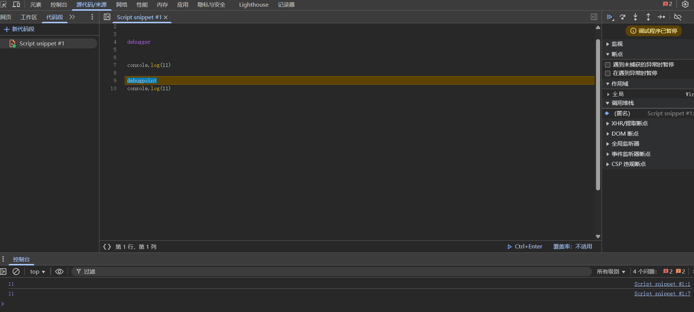
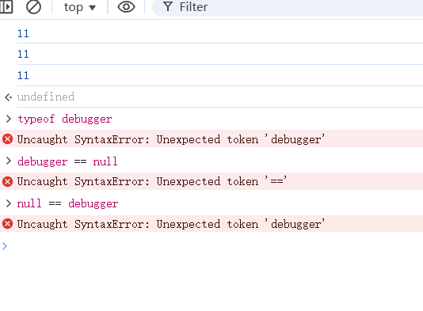

# 完美修改 debugger 无法被检测
在上篇以 `将 debugger 关键字的 token 换成 null, 添加一个自己关键字` 思路修改的 debugger 事实上是可以被检测的, 比如 `typeof debugger` `debugger == null` `debugger >= null`... 正常来说应该会报错, 但将 debugger 关键字的 token 换成 null 后就不一样了。这篇换一个新思路在语法分析阶段修改 debugger 的行为, 做到无法被检测

## 思路
新增一个关键字、以及对应 token, 在语法分析时生成重新定义生成 ast 的行为, 实现一个自己关键字代替 debugger 阻断调试器。

## 修改 `v8/src/parsing/keywords.txt` 文件, 运行脚本, 重新重新生成 `v8/src/parsing/keywords-gen.h`
这部分需要在 Linux 上完成, windows 使用脚本会比较麻烦, 不过, windows 上的小伙伴也不用怕, 我会将生成的 `v8/src/parsing/keywords-gen.h` 文件放在附件中, 直接使用就好了。

在 `v8/src/parsing/keywords.txt` 文件​​添加新关键字定义 `debugpoint, Token::kDebugPoint`
```
continue, Token::kContinue
debugger, Token::kDebugger
debugpoint, Token::kDebugPoint
```
修正 `v8/tools/gen-keywords-gen-h.py` 中 clang_format_path 的路径, 然后执行
```bash
cd v8
python3 ./tools/gen-keywords-gen-h.py
```
ok, 完成了第一步, 然后是添加新的 token 解决报错, 跟进 token 定义的地方, 在 `v8/src/parsing/token.h` 中仿照着 `debugger` 增加 `debugpoint`
```cpp
K(kDebugger, "debugger", 0)                                                 \
K(kDebugPoint, "debugpoint", 0)                                      \
```
别忘了关键字预检测那里, 在上一篇中我们重点分析了, 这里不在赘述, 直接搜索 `KEYWORDS(KEYWORD_GROUP, KEYWORD)` 定位, 然后增加:
```cpp
KEYWORD_GROUP('d')                                      \
KEYWORD("debugger", Token::kDebugger)                   \
KEYWORD("debugpoint", Token::kDebugPoint)               \
KEYWORD("default", Token::kDefault)                     \
```

## 阅读语法分析解析 `Token::kDebugger` 代码 
因为不是讲阅读 v8 源码的文章, 不在赘述怎么跟的, 直接看 `v8\src\parsing\parser-base.h` 中的 `typename ParserBase<Impl>::StatementT ParserBase<Impl>::ParseStatement` 函数:
```cpp

template <typename Impl>
typename ParserBase<Impl>::StatementT ParserBase<Impl>::ParseStatement(
    ZonePtrList<const AstRawString>* labels,
    ZonePtrList<const AstRawString>* own_labels,
    AllowLabelledFunctionStatement allow_function) {
  // Statement ::
  //   Block
  //   VariableStatement
  //   EmptyStatement
  //   ExpressionStatement
  //   IfStatement
  //   IterationStatement
  //   ContinueStatement
  //   BreakStatement
  //   ReturnStatement
  //   WithStatement
  //   LabelledStatement
  //   SwitchStatement
  //   ThrowStatement
  //   TryStatement
  //   DebuggerStatement

  // {own_labels} is always a subset of {labels}.
  DCHECK_IMPLIES(labels == nullptr, own_labels == nullptr);

  // Note: Since labels can only be used by 'break' and 'continue'
  // statements, which themselves are only valid within blocks,
  // iterations or 'switch' statements (i.e., BreakableStatements),
  // labels can be simply ignored in all other cases; except for
  // trivial labeled break statements 'label: break label' which is
  // parsed into an empty statement.
  switch (peek()) {
    case Token::kLeftBrace:
      return ParseBlock(labels);
    case Token::kSemicolon:
      Next();
      return factory()->EmptyStatement();
    case Token::kIf:
      return ParseIfStatement(labels);
    case Token::kDo:
      return ParseDoWhileStatement(labels, own_labels);
    case Token::kWhile:
      return ParseWhileStatement(labels, own_labels);
    case Token::kFor:
      if (V8_UNLIKELY(is_await_allowed() && PeekAhead() == Token::kAwait)) {
        return ParseForAwaitStatement(labels, own_labels);
      }
      return ParseForStatement(labels, own_labels);
    case Token::kContinue:
      return ParseContinueStatement();
    case Token::kBreak:
      return ParseBreakStatement(labels);
    case Token::kReturn:
      return ParseReturnStatement();
    case Token::kThrow:
      return ParseThrowStatement();
    case Token::kTry: {
      // It is somewhat complicated to have labels on try-statements.
      // When breaking out of a try-finally statement, one must take
      // great care not to treat it as a fall-through. It is much easier
      // just to wrap the entire try-statement in a statement block and
      // put the labels there.
      if (labels == nullptr) return ParseTryStatement();
      StatementListT statements(pointer_buffer());
      BlockT result = factory()->NewBlock(false, true);
      Target target(this, result, labels, nullptr,
                    Target::TARGET_FOR_NAMED_ONLY);
      StatementT statement = ParseTryStatement();
      statements.Add(statement);
      result->InitializeStatements(statements, zone());
      return result;
    }
    case Token::kWith:
      return ParseWithStatement(labels);
    case Token::kSwitch:
      return ParseSwitchStatement(labels);
    case Token::kFunction:
      // FunctionDeclaration only allowed as a StatementListItem, not in
      // an arbitrary Statement position. Exceptions such as
      // ES#sec-functiondeclarations-in-ifstatement-statement-clauses
      // are handled by calling ParseScopedStatement rather than
      // ParseStatement directly.
      impl()->ReportMessageAt(scanner()->peek_location(),
                              is_strict(language_mode())
                                  ? MessageTemplate::kStrictFunction
                                  : MessageTemplate::kSloppyFunction);
      return impl()->NullStatement();
    case Token::kDebugger:
      return ParseDebuggerStatement();
    case Token::kVar:
      return ParseVariableStatement(kStatement, nullptr);
    case Token::kAsync:
      if (!impl()->HasCheckedSyntax() &&
          !scanner()->HasLineTerminatorAfterNext() &&
          PeekAhead() == Token::kFunction) {
        impl()->ReportMessageAt(
            scanner()->peek_location(),
            MessageTemplate::kAsyncFunctionInSingleStatementContext);
        return impl()->NullStatement();
      }
      [[fallthrough]];
    default:
      return ParseExpressionOrLabelledStatement(labels, own_labels,
                                                allow_function);
  }
}
```
v8 的语法分析是 LL(1) + 递归下降, 当遇到 Token::kDebugger 时会进入 `ParseDebuggerStatement` 函数, 我们, 然后超出这个函数文法的会交给 `ParseExpressionOrLabelledStatement` 来实现有优先级的解析。让我们来看看 `ParseDebuggerStatement` 函数如何生成 ast 的:
```cpp
template <typename Impl>
typename ParserBase<Impl>::StatementT
ParserBase<Impl>::ParseDebuggerStatement() {
  // In ECMA-262 'debugger' is defined as a reserved keyword. In some browser
  // contexts this is used as a statement which invokes the debugger as i a
  // break point is present.
  // DebuggerStatement ::
  //   'debugger' ';'

  int pos = peek_position();
  Consume(Token::kDebugger);
  ExpectSemicolon();
  return factory()->NewDebuggerStatement(pos);
}
```
做的很简单, 消耗掉 token 然后生成 ast 节点, 知道这些我们可以开始魔改了。

## 增加 `Token::kDebugPoint` 对应的 ast, 置空 `Token::kDebugger` 对应的 ast
回到 `ParseStatement` 函数, 增加:
```cpp
case Token::kDebugPoint:
    return ParseDebugPointStatement();
```
在 `ParseDebuggerStatement` 下面增加 `ParseDebugPointStatement` 函数:
```cpp
template <typename Impl>
typename ParserBase<Impl>::StatementT
ParserBase<Impl>::ParseDebuggerStatement() {
  // In ECMA-262 'debugger' is defined as a reserved keyword. In some browser
  // contexts this is used as a statement which invokes the debugger as i a
  // break point is present.
  // DebuggerStatement ::
  //   'debugger' ';'

  int pos = peek_position();
  Consume(Token::kDebugger);
  ExpectSemicolon();
  return factory()->NewDebuggerStatement(pos);
}

template <typename Impl>
typename ParserBase<Impl>::StatementT
ParserBase<Impl>::ParseDebugPointStatement() {

  int pos = peek_position();
  Consume(Token::kDebugPoint);
  ExpectSemicolon();
  return factory()->NewDebuggerStatement(pos);
}
```
在头文件中增加定义:
```cpp
StatementT ParseDebuggerStatement();

StatementT ParseDebugPointStatement();
```
让 `ParseDebuggerStatement` 函数返回空语句:
```cpp
template <typename Impl>
typename ParserBase<Impl>::StatementT
ParserBase<Impl>::ParseDebuggerStatement() {
  // In ECMA-262 'debugger' is defined as a reserved keyword. In some browser
  // contexts this is used as a statement which invokes the debugger as i a
  // break point is present.
  // DebuggerStatement ::
  //   'debugger' ';'

  // int pos = peek_position();
  // Consume(Token::kDebugger);
  // ExpectSemicolon();
  // return factory()->NewDebuggerStatement(pos);

  Consume(Token::kDebugger);
  ExpectSemicolon();
  return factory()->EmptyStatement(); 
}
```

## 重新编译
```bash
autoninja -C out/Debug chrome
# autoninja -C out/Release chrome
```

## 试验一下
两个对比

无法被检测

