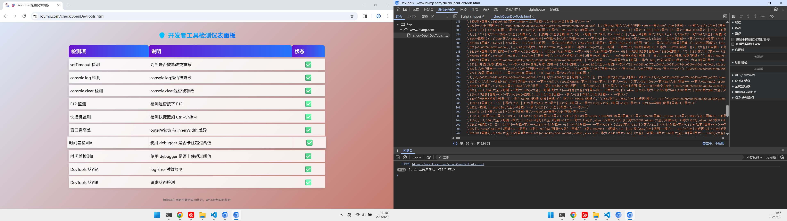

## 如果对 V8 Inspector 一头雾水的话, 可以参考一下我写 V8 Inspector 的文章
https://zhuanlan.zhihu.com/p/1914743287018914008

## 思路
改变 cdp 中 Console 的实现, 让 devtools 无法再通过 console、throw 检测

## 让我们从 `v8/src/inspector/v8-console.cc` 开始
以 `console.log` 为例子, 当 JS 调用 `console.log` 时, V8 会通过​​外部引用​​机制调用注册的 C++ 函数, 具体实现:
```cpp
void V8Console::Log(const v8::debug::ConsoleCallArguments& info,
                    const v8::debug::ConsoleContext& consoleContext) {
  TRACE_EVENT0(TRACE_DISABLED_BY_DEFAULT("v8.inspector"), "V8Console::Log");
  ConsoleHelper(info, consoleContext, m_inspector)
      .reportCall(ConsoleAPIType::kLog);
}
```
而 console 所有要输出到控制台的内容都会通过 ConsoleHelper 类中的 `reportCall` 方法传输, 让我们来看看它的实现:
```cpp
// 参数：
// - type: 控制台 API 类型(例如 log、error、trace 等)。
// - arguments: 调用时传递的参数列表。
void reportCall(ConsoleAPIType type,
                v8::MemorySpan<const v8::Local<v8::Value>> arguments) {
  // 如果当前上下文不属于任何上下文组，则直接返回，不进行任何操作。
  if (!groupId()) return;

  // 根据控制台消息的类型，决定捕获堆栈跟踪的深度。
  // 有些情况下可能只捕获部分堆栈，或者根本不捕获堆栈。
  std::unique_ptr<V8StackTraceImpl> stackTrace;

  // 根据控制台 API 类型选择合适的堆栈跟踪捕获策略。
  switch (type) {
    case ConsoleAPIType::kTrace:
      // `console.trace()` 的目的是在开发者工具控制台中输出完整的堆栈跟踪。
      // 因此，即使尚未连接调试器，也应始终尝试捕获完整的堆栈跟踪。
      stackTrace = m_inspector->debugger()->captureStackTrace(true);
      break;

    case ConsoleAPIType::kTimeEnd:
      // `console.time()` 和 `console.timeEnd()` API 用于性能分析。
      // 为了减少这些调用的总开销，并确保这些 API 的性能开销一致，
      // 始终只捕获顶部帧。否则，`console.timeEnd()` 的性能特性会因当前调用深度的不同而有所差异，从而歪曲结果。
      // 更多信息请参见：https://crbug.com/41433391
      stackTrace = V8StackTraceImpl::capture(m_inspector->debugger(), 1);
      break;

    default:
      // 对于其他 API，只有在调试器连接时才捕获完整的堆栈跟踪，否则只记录顶部帧。
      stackTrace = m_inspector->debugger()->captureStackTrace(false);
      break;
  }

  // 创建一个控制台消息对象，用于封装控制台 API 调用的相关信息。
  std::unique_ptr<V8ConsoleMessage> message =
      V8ConsoleMessage::createForConsoleAPI(
          context(),  // 当前 V8 上下文
          contextId(),  // 当前上下文的 ID
          groupId(),  // 当前上下文所属的上下文组 ID
          m_inspector,  // V8InspectorImpl 实例
          m_inspector->client()->currentTimeMS(),  // 当前时间戳
          type,  // 控制台 API 类型
          arguments,  // 调用时传递的参数列表
          consoleContextToString(isolate(), m_consoleContext),  // 控制台上下文信息
          std::move(stackTrace)  // 捕获的堆栈跟踪
      );

  // 将创建的控制台消息添加到控制台消息存储中。
  consoleMessageStorage()->addMessage(std::move(message));
}
```
## 先让我们看看 `V8ConsoleMessage::createForConsoleAPI` 都做了什么:
```cpp
// 参数：
// - v8Context: 当前的 V8 上下文。
// - contextId: 当前上下文的 ID。
// - groupId: 当前上下文所属的上下文组 ID。
// - inspector: V8InspectorImpl 实例，用于访问调试器功能。
// - timestamp: 当前时间戳。
// - type: 控制台 API 类型(例如 log、error、warning 等)。
// - arguments: 控制台 API 调用时传递的参数列表。
// - consoleContext: 控制台上下文信息。
// - stackTrace: 捕获的堆栈跟踪。
std::unique_ptr<V8ConsoleMessage> V8ConsoleMessage::createForConsoleAPI(
    v8::Local<v8::Context> v8Context, int contextId, int groupId,
    V8InspectorImpl* inspector, double timestamp, ConsoleAPIType type,
    v8::MemorySpan<const v8::Local<v8::Value>> arguments,
    const String16& consoleContext,
    std::unique_ptr<V8StackTraceImpl> stackTrace) {
  // 获取当前的 V8 引擎隔离区。
  v8::Isolate* isolate = v8::Isolate::GetCurrent();

  // 创建一个 V8ConsoleMessage 对象，初始化其来源为控制台，时间戳为当前时间，消息为空字符串。
  std::unique_ptr<V8ConsoleMessage> message(
      new V8ConsoleMessage(V8MessageOrigin::kConsole, timestamp, String16()));

  // 如果有堆栈跟踪且堆栈跟踪不为空，则提取堆栈顶部的信息。
  if (stackTrace && !stackTrace->isEmpty()) {
    message->m_url = toString16(stackTrace->topSourceURL());  // 堆栈顶部的源代码 URL
    message->m_lineNumber = stackTrace->topLineNumber();     // 堆栈顶部的行号
    message->m_columnNumber = stackTrace->topColumnNumber(); // 堆栈顶部的列号
  }

  // 将堆栈跟踪对象附加到消息中。
  message->m_stackTrace = std::move(stackTrace);

  // 设置控制台上下文信息。
  message->m_consoleContext = consoleContext;

  // 设置控制台 API 类型。
  message->m_type = type;

  // 设置上下文 ID。
  message->m_contextId = contextId;

  // 遍历参数列表，将每个参数封装为全局句柄并附加到消息中。
  for (v8::Local<v8::Value> arg : arguments) {
    std::unique_ptr<v8::Global<v8::Value>> argument(
        new v8::Global<v8::Value>(isolate, arg)); // 创建全局句柄
    argument->AnnotateStrongRetainer(kGlobalConsoleMessageHandleLabel); // 标记强引用
    message->m_arguments.push_back(std::move(argument)); // 将参数附加到消息中
    message->m_v8Size += v8::debug::EstimatedValueSize(isolate, arg); // 累加参数的大小
  }

  // 将参数列表中的值转换为字符串，并拼接成一条完整的控制台消息。
  bool sep = false; // 用于控制参数之间的分隔符
  for (v8::Local<v8::Value> arg : arguments) {
    if (sep) {
      message->m_message += String16(" "); // 在参数之间添加空格
    } else {
      sep = true;
    }
    message->m_message += V8ValueStringBuilder::toString(arg, v8Context); // 将参数转换为字符串并拼接
  }

  // 根据控制台 API 类型，确定消息的级别。
  v8::Isolate::MessageErrorLevel clientLevel = v8::Isolate::kMessageInfo;
  if (type == ConsoleAPIType::kDebug || type == ConsoleAPIType::kCount ||
      type == ConsoleAPIType::kTimeEnd) {
    clientLevel = v8::Isolate::kMessageDebug; // 调试级别
  } else if (type == ConsoleAPIType::kError ||
             type == ConsoleAPIType::kAssert) {
    clientLevel = v8::Isolate::kMessageError; // 错误级别
  } else if (type == ConsoleAPIType::kWarning) {
    clientLevel = v8::Isolate::kMessageWarning; // 警告级别
  } else if (type == ConsoleAPIType::kInfo) {
    clientLevel = v8::Isolate::kMessageInfo; // 信息级别
  } else if (type == ConsoleAPIType::kLog) {
    clientLevel = v8::Isolate::kMessageLog; // 日志级别
  }

  // 如果不是清空操作，则将消息发送到宿主环境。
  if (type != ConsoleAPIType::kClear) {
    inspector->client()->consoleAPIMessage(
        groupId, clientLevel, toStringView(message->m_message), // 消息内容
        toStringView(message->m_url), message->m_lineNumber,    // 源代码位置
        message->m_columnNumber, message->m_stackTrace.get()); // 堆栈跟踪
  }

  // 返回创建的 V8ConsoleMessage 对象。
  return message;
}
```
总结来说, 创建一个 V8ConsoleMessage 对象，用于封装控制台 API 调用的信息。然后如果不是清空操作，则将消息发送到宿主环境。让我们聚焦:
```cpp
inspector->client()->consoleAPIMessage(
    groupId, clientLevel, toStringView(message->m_message), // 消息内容
    toStringView(message->m_url), message->m_lineNumber,    // 源代码位置
    message->m_columnNumber, message->m_stackTrace.get()); // 堆栈跟踪
```
在 V8 的默认实现中，此方法是空方法或未实现。若运行时未主动处理，则无任何输出。需由运行时开发者通过继承 V8InspectorClient 并重写 consoleAPIMessage() 实现。

## 再来看看 `consoleMessageStorage()->addMessage` 的实现:
```cpp
// 参数：
// - message: 要添加的控制台消息对象。
void V8ConsoleMessageStorage::addMessage(
    std::unique_ptr<V8ConsoleMessage> message) {
  // 获取当前上下文组 ID 和关联的 V8InspectorImpl 实例。
  int contextGroupId = m_contextGroupId;
  V8InspectorImpl* inspector = m_inspector;

  // 如果消息类型是清空控制台(kClear)，则清空当前存储的所有消息。
  if (message->type() == ConsoleAPIType::kClear) clear();

  // 记录控制台消息事件，用于跟踪消息的来源和类型。
  TraceV8ConsoleMessageEvent(message->origin(), message->type());

  // 遍历当前上下文组的所有调试会话，并通知会话中的控制台代理和运行时代理。
  inspector->forEachSession(
      contextGroupId, [&message](V8InspectorSessionImpl* session) {
        if (message->origin() == V8MessageOrigin::kConsole)
          session->consoleAgent()->messageAdded(message.get());
        session->runtimeAgent()->messageAdded(message.get());
      });

  // 如果当前上下文组没有启用控制台消息存储，则直接返回。
  if (!inspector->hasConsoleMessageStorage(contextGroupId)) return;

  // 确保消息队列的大小不超过最大限制。
  DCHECK(m_messages.size() <= maxConsoleMessageCount);

  // 如果消息队列已满(达到最大消息数量限制)，则移除最早添加的消息。
  if (m_messages.size() == maxConsoleMessageCount) {
    m_estimatedSize -= m_messages.front()->estimatedSize(); // 减少总大小估计
    m_messages.pop_front(); // 移除最早的消息
  }

  // 如果添加当前消息后，总大小估计超过最大 V8 大小限制，则移除最早的消息，直到总大小符合限制。
  while (m_estimatedSize + message->estimatedSize() > maxConsoleMessageV8Size &&
         !m_messages.empty()) {
    m_estimatedSize -= m_messages.front()->estimatedSize(); // 减少总大小估计
    m_messages.pop_front(); // 移除最早的消息
  }

  // 将新消息添加到消息队列中。
  m_messages.push_back(std::move(message));
  // 更新总大小估计。
  m_estimatedSize += m_messages.back()->estimatedSize();
}
```
总结来说就是向 devtools 的控制台消息存储中添加一条新的控制台消息, 并将消息累积。让我们聚焦:
```cpp
inspector->forEachSession(
    contextGroupId, [&message](V8InspectorSessionImpl* session) {
    if (message->origin() == V8MessageOrigin::kConsole)
        session->consoleAgent()->messageAdded(message.get());
    session->runtimeAgent()->messageAdded(message.get());
    });
```
首先看看这个枚举对象 `V8MessageOrigin::kConsole`:
```cpp
enum class V8MessageOrigin { kConsole, kException, kRevokedException };
```
`kConsole` 代表了 console 输出的 devtools 控制台消息, `kException` 表示 throw 出来的异常消息, `kRevokedException` 表示被撤销的异常, 在 devtools 中出错的 js 会有红线标记, 改对后, 需要撤销红线。

再来看看 `session->consoleAgent()->messageAdded(message.get())` consoleAgent 的 `messageAdded`, 在 `V8 Inspector` 那篇文章有提及, consoleAgent 是 devtools cdp 中控制台消息的代理, 负责向控制台输出消息。
```cpp
void V8ConsoleAgentImpl::messageAdded(V8ConsoleMessage* message) {
  if (m_enabled) reportMessage(message, true);
}
```
这里判断了 devtools console 域是否打开, 打开的话就向其发送消息, 否则就是什么也不做。再跟进 reportMessage:
```cpp
bool V8ConsoleAgentImpl::reportMessage(V8ConsoleMessage* message,
                                       bool generatePreview) {
  DCHECK_EQ(V8MessageOrigin::kConsole, message->origin());
  message->reportToFrontend(&m_frontend);
  m_frontend.flush();
  return m_session->inspector()->hasConsoleMessageStorage(
      m_session->contextGroupId());
}
```
跟入 `message->reportToFrontend`:
```cpp
void V8ConsoleMessage::reportToFrontend(
    protocol::Console::Frontend* frontend) const {
  DCHECK_EQ(V8MessageOrigin::kConsole, m_origin);
  String16 level = protocol::Console::ConsoleMessage::LevelEnum::Log;
  if (m_type == ConsoleAPIType::kDebug || m_type == ConsoleAPIType::kCount ||
      m_type == ConsoleAPIType::kTimeEnd)
    level = protocol::Console::ConsoleMessage::LevelEnum::Debug;
  else if (m_type == ConsoleAPIType::kError ||
           m_type == ConsoleAPIType::kAssert)
    level = protocol::Console::ConsoleMessage::LevelEnum::Error;
  else if (m_type == ConsoleAPIType::kWarning)
    level = protocol::Console::ConsoleMessage::LevelEnum::Warning;
  else if (m_type == ConsoleAPIType::kInfo)
    level = protocol::Console::ConsoleMessage::LevelEnum::Info;
  std::unique_ptr<protocol::Console::ConsoleMessage> result =
      protocol::Console::ConsoleMessage::create()
          .setSource(protocol::Console::ConsoleMessage::SourceEnum::ConsoleApi)
          .setLevel(level)
          .setText(m_message)
          .build();
  if (m_lineNumber) result->setLine(m_lineNumber);
  if (m_columnNumber) result->setColumn(m_columnNumber);
  if (!m_url.isEmpty()) result->setUrl(m_url);
  frontend->messageAdded(std::move(result));
}
```
在跟入 `frontend->messageAdded`, 来到了 `out/Debug/gen/v8/src/inspector/protocol/Console.cpp` 文件中的
```cpp
void Frontend::messageAdded(std::unique_ptr<protocol::Console::ConsoleMessage> message)
{
    if (!frontend_channel_)
        return;
    v8_crdtp::ObjectSerializer serializer;
    serializer.AddField(v8_crdtp::MakeSpan("message"), message);
    frontend_channel_->SendProtocolNotification(v8_crdtp::CreateNotification("Console.messageAdded", serializer.Finish()));
}
```
看过 `https://zhuanlan.zhihu.com/p/1914743287018914008` 讲 V8 Inspector 这篇的小伙伴应该反应过来了, 这就是 cdp 中 `Console.messageAdded` 的实现, 将消息通过 cdp 协议发给 devtools。

回头再看 `session->runtimeAgent()->messageAdded(message.get())` runtimeAgent 是 cdp 中的 runtime 域。和 consoleAgent 类似:
```cpp
void V8RuntimeAgentImpl::messageAdded(V8ConsoleMessage* message) {
  if (m_enabled) reportMessage(message, true);
}
bool V8RuntimeAgentImpl::reportMessage(V8ConsoleMessage* message,
                                       bool generatePreview) {
  message->reportToFrontend(&m_frontend, m_session, generatePreview);
  m_frontend.flush();
  return m_inspector->hasConsoleMessageStorage(m_session->contextGroupId());
}
```
跳过上面这两个过程函数, 跟入 `message->reportToFrontend`
```cpp
void V8ConsoleMessage::reportToFrontend(protocol::Runtime::Frontend* frontend,
                                        V8InspectorSessionImpl* session,
                                        bool generatePreview) const {
  // 获取当前上下文组 ID
  int contextGroupId = session->contextGroupId();
  // 获取 V8InspectorImpl 实例
  V8InspectorImpl* inspector = session->inspector();
  // 防止通过中断重新进入调试器调用
  v8::debug::PostponeInterruptsScope no_interrupts(inspector->isolate());

  // 根据消息来源类型处理不同的情况
  if (m_origin == V8MessageOrigin::kException) {
    // 如果是异常消息，将异常包装为 RemoteObject
    std::unique_ptr<protocol::Runtime::RemoteObject> exception =
        wrapException(session, generatePreview);
    // 如果当前上下文组没有控制台消息存储，则直接返回
    if (!inspector->hasConsoleMessageStorage(contextGroupId)) return;
    // 创建异常详情对象
    std::unique_ptr<protocol::Runtime::ExceptionDetails> exceptionDetails =
        protocol::Runtime::ExceptionDetails::create()
            .setExceptionId(m_exceptionId)
            .setText(exception ? m_message : m_detailedMessage)  // 设置异常文本
            .setLineNumber(m_lineNumber ? m_lineNumber - 1 : 0)  // 设置行号
            .setColumnNumber(m_columnNumber ? m_columnNumber - 1 : 0)  // 设置列号
            .build();
    // 如果有脚本 ID，则设置脚本 ID
    if (m_scriptId)
      exceptionDetails->setScriptId(String16::fromInteger(m_scriptId));
    // 如果有 URL，则设置 URL
    if (!m_url.isEmpty()) exceptionDetails->setUrl(m_url);
    // 如果有堆栈跟踪，则设置堆栈跟踪
    if (m_stackTrace) {
      exceptionDetails->setStackTrace(
          m_stackTrace->buildInspectorObjectImpl(inspector->debugger()));
    }
    // 如果有上下文 ID，则设置上下文 ID
    if (m_contextId) exceptionDetails->setExecutionContextId(m_contextId);
    // 如果有异常对象，则设置异常对象
    if (exception) exceptionDetails->setException(std::move(exception));
    // 获取与异常相关的元数据
    std::unique_ptr<protocol::DictionaryValue> data =
        getAssociatedExceptionData(inspector, session);
    if (data) exceptionDetails->setExceptionMetaData(std::move(data));
    // 向前端报告异常抛出
    frontend->exceptionThrown(m_timestamp, std::move(exceptionDetails));
    return;
  }

  // 如果是撤销异常的消息
  if (m_origin == V8MessageOrigin::kRevokedException) {
    // 向前端报告异常被撤销
    frontend->exceptionRevoked(m_message, m_revokedExceptionId);
    return;
  }

  // 如果是控制台消息
  if (m_origin == V8MessageOrigin::kConsole) {
    // 将控制台参数包装为 RemoteObject 数组
    std::unique_ptr<protocol::Array<protocol::Runtime::RemoteObject>>
        arguments = wrapArguments(session, generatePreview);
    // 如果当前上下文组没有控制台消息存储，则直接返回
    if (!inspector->hasConsoleMessageStorage(contextGroupId)) return;
    // 如果参数为空，则创建一个默认的参数数组
    if (!arguments) {
      arguments =
          std::make_unique<protocol::Array<protocol::Runtime::RemoteObject>>();
      if (!m_message.isEmpty()) {
        // 如果有消息文本，则创建一个字符串类型的 RemoteObject
        std::unique_ptr<protocol::Runtime::RemoteObject> messageArg =
            protocol::Runtime::RemoteObject::create()
                .setType(protocol::Runtime::RemoteObject::TypeEnum::String)
                .build();
        messageArg->setValue(protocol::StringValue::create(m_message));
        arguments->emplace_back(std::move(messageArg));
      }
    }
    // 获取控制台上下文
    std::optional<String16> consoleContext;
    if (!m_consoleContext.isEmpty()) consoleContext = m_consoleContext;
    // 获取堆栈跟踪
    std::unique_ptr<protocol::Runtime::StackTrace> stackTrace;
    if (m_stackTrace) {
      // 根据控制台类型决定堆栈跟踪的深度
      switch (m_type) {
        case ConsoleAPIType::kAssert:
        case ConsoleAPIType::kError:
        case ConsoleAPIType::kTrace:
        case ConsoleAPIType::kWarning:
          stackTrace =
              m_stackTrace->buildInspectorObjectImpl(inspector->debugger());
          break;
        default:
          stackTrace =
              m_stackTrace->buildInspectorObjectImpl(inspector->debugger(), 0);
          break;
      }
    }
    // 向前端报告控制台 API 调用
    frontend->consoleAPICalled(
        consoleAPITypeValue(m_type), std::move(arguments), m_contextId,
        m_timestamp, std::move(stackTrace), std::move(consoleContext));
    return;
  }

  // 如果消息来源类型未知，则触发断言失败
  UNREACHABLE();
}
```
同样 `frontend->exceptionThrown` `frontend->exceptionRevoked` `frontend->consoleAPICalled` 是 runtime 域 cdp 协议的实现:
```cpp
void Frontend::consoleAPICalled(const String& type, std::unique_ptr<protocol::Array<protocol::Runtime::RemoteObject>> args, int executionContextId, double timestamp, std::unique_ptr<protocol::Runtime::StackTrace> stackTrace, std::optional<String> context)
{
    if (!frontend_channel_)
        return;
    v8_crdtp::ObjectSerializer serializer;
    serializer.AddField(v8_crdtp::MakeSpan("type"), type);
    serializer.AddField(v8_crdtp::MakeSpan("args"), args);
    serializer.AddField(v8_crdtp::MakeSpan("executionContextId"), executionContextId);
    serializer.AddField(v8_crdtp::MakeSpan("timestamp"), timestamp);
    serializer.AddField(v8_crdtp::MakeSpan("stackTrace"), stackTrace);
    serializer.AddField(v8_crdtp::MakeSpan("context"), context);
    frontend_channel_->SendProtocolNotification(v8_crdtp::CreateNotification("Runtime.consoleAPICalled", serializer.Finish()));
}

void Frontend::exceptionRevoked(const String& reason, int exceptionId)
{
    if (!frontend_channel_)
        return;
    v8_crdtp::ObjectSerializer serializer;
    serializer.AddField(v8_crdtp::MakeSpan("reason"), reason);
    serializer.AddField(v8_crdtp::MakeSpan("exceptionId"), exceptionId);
    frontend_channel_->SendProtocolNotification(v8_crdtp::CreateNotification("Runtime.exceptionRevoked", serializer.Finish()));
}

void Frontend::exceptionThrown(double timestamp, std::unique_ptr<protocol::Runtime::ExceptionDetails> exceptionDetails)
{
    if (!frontend_channel_)
        return;
    v8_crdtp::ObjectSerializer serializer;
    serializer.AddField(v8_crdtp::MakeSpan("timestamp"), timestamp);
    serializer.AddField(v8_crdtp::MakeSpan("exceptionDetails"), exceptionDetails);
    frontend_channel_->SendProtocolNotification(v8_crdtp::CreateNotification("Runtime.exceptionThrown", serializer.Finish()));
}
```
将各自的消息报告到 devtools。

分析到这, 有点小伙伴可能会疑惑在最开头说了 "console 所有要输出到控制台的内容都会通过 ConsoleHelper 类中的 `reportCall` 方法传输" , 那直接在 reportCall 一开始返回不就行了, 还扯这么多干嘛。事实上这样做只能解决 console 的检测, 无法过掉 throw 的检测(检测代码`https://github.com/wushenperson/throwCheckOpen`), 为了过掉 throw 的检测, 还要继续我们的旅程, 搜索 `V8MessageOrigin::kException`, 定位到 `v8/src/inspector/v8-console-message.cc` 中 `V8ConsoleMessage::createForException` 函数, 创建一个异常消息, 查看它的引用, 来到了 `v8/src/inspector/v8-inspector-impl.cc` 中的 `V8InspectorImpl::exceptionThrown` 函数:
```cpp
unsigned V8InspectorImpl::exceptionThrown(
    v8::Local<v8::Context> context, StringView message,
    v8::Local<v8::Value> exception, StringView detailedMessage, StringView url,
    unsigned lineNumber, unsigned columnNumber,
    std::unique_ptr<V8StackTrace> stackTrace, int scriptId) {
  int groupId = contextGroupId(context);
  if (!groupId || m_muteExceptionsMap[groupId]) return 0;
  std::unique_ptr<V8StackTraceImpl> stackTraceImpl(
      static_cast<V8StackTraceImpl*>(stackTrace.release()));
  unsigned exceptionId = nextExceptionId();
  std::unique_ptr<V8ConsoleMessage> consoleMessage =
      V8ConsoleMessage::createForException(
          m_client->currentTimeMS(), toString16(detailedMessage),
          toString16(url), lineNumber, columnNumber, std::move(stackTraceImpl),
          scriptId, m_isolate, toString16(message),
          InspectedContext::contextId(context), exception, exceptionId);
  ensureConsoleMessageStorage(groupId)->addMessage(std::move(consoleMessage));
  return exceptionId;
}
```
跟进 `ensureConsoleMessageStorage(groupId)->addMessage(std::move(consoleMessage))`, 又回到了 `V8ConsoleMessageStorage::addMessage` 函数:
```cpp
void V8ConsoleMessageStorage::addMessage(
    std::unique_ptr<V8ConsoleMessage> message) {
  int contextGroupId = m_contextGroupId;
  V8InspectorImpl* inspector = m_inspector;
  if (message->type() == ConsoleAPIType::kClear) clear();

  TraceV8ConsoleMessageEvent(message->origin(), message->type());

  inspector->forEachSession(
      contextGroupId, [&message](V8InspectorSessionImpl* session) {
        if (message->origin() == V8MessageOrigin::kConsole)
          session->consoleAgent()->messageAdded(message.get());
        session->runtimeAgent()->messageAdded(message.get());
      });
  if (!inspector->hasConsoleMessageStorage(contextGroupId)) return;

  DCHECK(m_messages.size() <= maxConsoleMessageCount);
  if (m_messages.size() == maxConsoleMessageCount) {
    m_estimatedSize -= m_messages.front()->estimatedSize();
    m_messages.pop_front();
  }
  while (m_estimatedSize + message->estimatedSize() > maxConsoleMessageV8Size &&
         !m_messages.empty()) {
    m_estimatedSize -= m_messages.front()->estimatedSize();
    m_messages.pop_front();
  }

  m_messages.push_back(std::move(message));
  m_estimatedSize += m_messages.back()->estimatedSize();
}
```
ok, 到此为止, 我们掌握 cdp 中向 devtools 控制台传输消息的大部分(还有一小部分是脚本段分离的报错消息, 和我们关注的 devtools 检测无关)。

## 开始魔改(只想快速魔改的小伙伴可以直接看这, 前面算是方法论)
让我们修改 `V8ConsoleMessageStorage::addMessage` 函数, 为它加一个默认参数:
```cpp
// v8/src/inspector/v8-console-message.h

// void addMessage(std::unique_ptr<V8ConsoleMessage>);
void addMessage(std::unique_ptr<V8ConsoleMessage>, bool isOutputToDevTools = false);

// v8/src/inspector/v8-console-message.cc
void V8ConsoleMessageStorage::addMessage(
    std::unique_ptr<V8ConsoleMessage> message, bool isOutputToDevTools) {
  // 默认不输出到 DevTools
  if (!isOutputToDevTools) return;
  
  int contextGroupId = m_contextGroupId;
  V8InspectorImpl* inspector = m_inspector;
  if (message->type() == ConsoleAPIType::kClear) clear();

  TraceV8ConsoleMessageEvent(message->origin(), message->type());

  inspector->forEachSession(
      contextGroupId, [&message](V8InspectorSessionImpl* session) {
        if (message->origin() == V8MessageOrigin::kConsole)
          session->consoleAgent()->messageAdded(message.get());
        session->runtimeAgent()->messageAdded(message.get());
      });
  if (!inspector->hasConsoleMessageStorage(contextGroupId)) return;

  DCHECK(m_messages.size() <= maxConsoleMessageCount);
  if (m_messages.size() == maxConsoleMessageCount) {
    m_estimatedSize -= m_messages.front()->estimatedSize();
    m_messages.pop_front();
  }
  while (m_estimatedSize + message->estimatedSize() > maxConsoleMessageV8Size &&
         !m_messages.empty()) {
    m_estimatedSize -= m_messages.front()->estimatedSize();
    m_messages.pop_front();
  }

  m_messages.push_back(std::move(message));
  m_estimatedSize += m_messages.back()->estimatedSize();
}
```

## 重新编译
```bash
autoninja -C out/Debug chrome
# autoninja -C out/Release chrome
```

## 试验一下(零点大佬的网站: https://www.ldvmp.com/)
四个检测:

全部通过:



